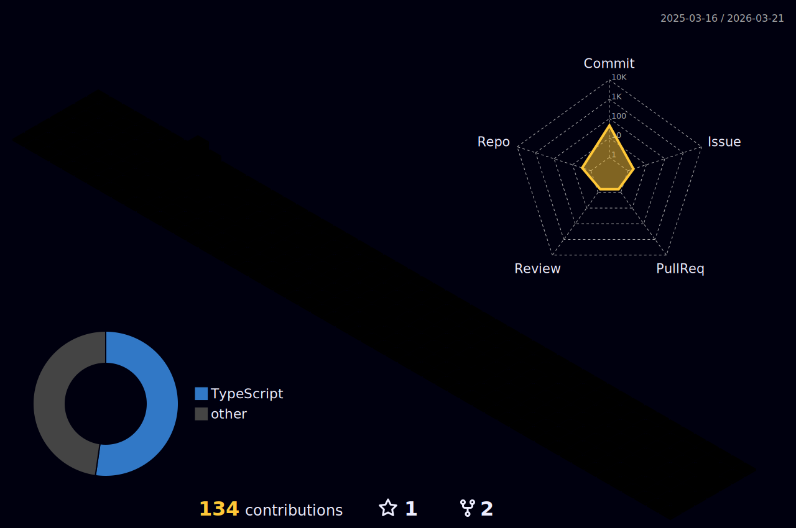

# Heey, tudo bem? 

Sou o **Rafael Aranda Martins**, apaixonado por **tecnologia**, **programação** e **jogos**.
- 💻 Trabalho como **Dev Front-end** (**Angular/TypeScript/PrimeNG**) na **DB System**.
- 🚀 Experiência sólida em **Angular**, **TypesCript/JavaScript**, **HTML** e **CSS/SCSS**;
- 🚀 Já trabalhei com **Flutter**, **Java**, **SQL**, ...
- 🎨 Gosto de explorar outras áreas como **Photoshop** e **Edição de Vídeos**.
- 📚 Sempre em busca de aprender e evoluir!

<br>

## 🌐 Me encontre

[](https://github.com/Skema1114)
[](https://gitlab.com/Skema1114)
[](https://www.linkedin.com/in/rafaelarandamartins/)
[](https://www.instagram.com/holdiny/)

<br>

## 📊 Minhas estatísticas

### 🚀 GitHub

<div>
  <a href="https://github.com/anuraghazra/github-readme-stats" target="_blank">
    
  </a>
  <br />
  <a href="https://github.com/denvercoder1/github-readme-streak-stats" target="_blank">
    
  </a>
  <br />
  <a href="https://github.com/vn7n24fzkq/github-profile-summary-cards" target="_blank"> 
    
  </a>
  <br />
  <a href="https://github.com/vn7n24fzkq/github-profile-summary-cards" target="_blank"> 
    
  </a>
  <br />
  <a href="https://github.com/Ashutosh00710/github-readme-activity-graph" target="_blank"> 
    
  </a>
</div>

### ⏳ WakaTime

<div>
  <a href="https://github.com/anuraghazra/github-readme-stats" target="_blank">
    
  </a>
  <br />
  <a href="https://github.com/anuraghazra/github-readme-stats" target="_blank">
    
  </a>
</div>

<br>

## 🏆 Conquistas

### 💻 Github

<div>
  <a href="https://github.com/ryo-ma/github-profile-trophy" target="_blank">
    
  </a>
</div>

<br>

### ✅ Todoist

<!-- TODO-IST:START -->
 Possuo **11,301** pontos de Karma;           
 Completei **0** tarefas hoje;           
 Completei **952** tarefas no total;           
 Sequência mais longa é de **8** dias;
<!-- TODO-IST:END -->

<br>

## 🧊 3D

### 🧾 Commits



### 🐍 Snake

<a href="https://github.com/Platane/snk" target="_blank">
    <picture>
      <source media="(prefers-color-scheme: dark)" srcset="https://raw.githubusercontent.com/skema1114/skema1114/output/github-contribution-grid-snake-dark.svg">
      <source media="(prefers-color-scheme: light)" srcset="https://raw.githubusercontent.com/skema1114/skema1114/output/github-contribution-grid-snake.svg">
      
    </picture>
</a>

<br>

## 📈 Mais estatísticas

  

[](https://wakatime.com/@Skema1114)

<!--START_SECTION:waka-->


**Eu sou diurno 🐤** 

```text
🌞 Manhã                  12524 commits       ⣿⣿⣿⣿⣿⣿⣿⣿⣀⣀⣀⣀⣀⣀⣀⣀⣀⣀⣀⣀⣀⣀⣀⣀⣀   30.68 % 
🌆 Tarde                  21241 commits       ⣿⣿⣿⣿⣿⣿⣿⣿⣿⣿⣿⣿⣿⣀⣀⣀⣀⣀⣀⣀⣀⣀⣀⣀⣀   52.04 % 
🌃 Noite                  6289 commits        ⣿⣿⣿⣿⣀⣀⣀⣀⣀⣀⣀⣀⣀⣀⣀⣀⣀⣀⣀⣀⣀⣀⣀⣀⣀   15.41 % 
🌙 Madrugada              762 commits         ⣀⣀⣀⣀⣀⣀⣀⣀⣀⣀⣀⣀⣀⣀⣀⣀⣀⣀⣀⣀⣀⣀⣀⣀⣀   01.87 % 
```
📅 **Sou mais produtivo em Terça-Feira** 

```text
Segunda-Feira            8417 commits        ⣿⣿⣿⣿⣿⣀⣀⣀⣀⣀⣀⣀⣀⣀⣀⣀⣀⣀⣀⣀⣀⣀⣀⣀⣀   20.62 % 
Terça-Feira              9187 commits        ⣿⣿⣿⣿⣿⣿⣀⣀⣀⣀⣀⣀⣀⣀⣀⣀⣀⣀⣀⣀⣀⣀⣀⣀⣀   22.51 % 
Quarta-Feira             8310 commits        ⣿⣿⣿⣿⣿⣀⣀⣀⣀⣀⣀⣀⣀⣀⣀⣀⣀⣀⣀⣀⣀⣀⣀⣀⣀   20.36 % 
Quinta-Feira             7437 commits        ⣿⣿⣿⣿⣿⣀⣀⣀⣀⣀⣀⣀⣀⣀⣀⣀⣀⣀⣀⣀⣀⣀⣀⣀⣀   18.22 % 
Sexta-Feira              6407 commits        ⣿⣿⣿⣿⣀⣀⣀⣀⣀⣀⣀⣀⣀⣀⣀⣀⣀⣀⣀⣀⣀⣀⣀⣀⣀   15.70 % 
Sábado                   523 commits         ⣀⣀⣀⣀⣀⣀⣀⣀⣀⣀⣀⣀⣀⣀⣀⣀⣀⣀⣀⣀⣀⣀⣀⣀⣀   01.28 % 
Domingo                  535 commits         ⣀⣀⣀⣀⣀⣀⣀⣀⣀⣀⣀⣀⣀⣀⣀⣀⣀⣀⣀⣀⣀⣀⣀⣀⣀   01.31 % 
```


📊 **Esta semana eu gastei meu tempo em** 

```text
🕑︎ Fuso horário: America/Sao_Paulo

💬 Linguagens de programação: 
TypeScript               6 hrs 58 mins       ⣿⣿⣿⣿⣿⣿⣿⣿⣿⣿⣿⣿⣿⣀⣀⣀⣀⣀⣀⣀⣀⣀⣀⣀⣀   51.53 % 
HTML                     3 hrs 15 mins       ⣿⣿⣿⣿⣿⣿⣀⣀⣀⣀⣀⣀⣀⣀⣀⣀⣀⣀⣀⣀⣀⣀⣀⣀⣀   24.01 % 
SCSS                     2 hrs               ⣿⣿⣿⣿⣀⣀⣀⣀⣀⣀⣀⣀⣀⣀⣀⣀⣀⣀⣀⣀⣀⣀⣀⣀⣀   14.85 % 
JSON                     37 mins             ⣿⣀⣀⣀⣀⣀⣀⣀⣀⣀⣀⣀⣀⣀⣀⣀⣀⣀⣀⣀⣀⣀⣀⣀⣀   04.59 % 
Markdown                 25 mins             ⣿⣀⣀⣀⣀⣀⣀⣀⣀⣀⣀⣀⣀⣀⣀⣀⣀⣀⣀⣀⣀⣀⣀⣀⣀   03.13 % 

🔥 Editores: 
VS Code                  13 hrs 32 mins      ⣿⣿⣿⣿⣿⣿⣿⣿⣿⣿⣿⣿⣿⣿⣿⣿⣿⣿⣿⣿⣿⣿⣿⣿⣿   100.00 % 

🐱‍💻 Projetos: 
fear-idle                8 hrs 58 mins       ⣿⣿⣿⣿⣿⣿⣿⣿⣿⣿⣿⣿⣿⣿⣿⣿⣿⣀⣀⣀⣀⣀⣀⣀⣀   66.33 % 
propulsor-ui             4 hrs 13 mins       ⣿⣿⣿⣿⣿⣿⣿⣿⣀⣀⣀⣀⣀⣀⣀⣀⣀⣀⣀⣀⣀⣀⣀⣀⣀   31.16 % 
arquivos                 20 mins             ⣿⣀⣀⣀⣀⣀⣀⣀⣀⣀⣀⣀⣀⣀⣀⣀⣀⣀⣀⣀⣀⣀⣀⣀⣀   02.51 % 

💻 Sistema operacional: 
Windows                  13 hrs 32 mins      ⣿⣿⣿⣿⣿⣿⣿⣿⣿⣿⣿⣿⣿⣿⣿⣿⣿⣿⣿⣿⣿⣿⣿⣿⣿   100.00 % 
```

**Eu geralmente programo em TypeScript** 

```text
TypeScript               26 repos            ⣿⣿⣿⣿⣿⣿⣿⣿⣿⣿⣀⣀⣀⣀⣀⣀⣀⣀⣀⣀⣀⣀⣀⣀⣀   40.00 % 
Java                     13 repos            ⣿⣿⣿⣿⣿⣀⣀⣀⣀⣀⣀⣀⣀⣀⣀⣀⣀⣀⣀⣀⣀⣀⣀⣀⣀   20.00 % 
JavaScript               10 repos            ⣿⣿⣿⣿⣀⣀⣀⣀⣀⣀⣀⣀⣀⣀⣀⣀⣀⣀⣀⣀⣀⣀⣀⣀⣀   15.38 % 
Dart                     6 repos             ⣿⣿⣀⣀⣀⣀⣀⣀⣀⣀⣀⣀⣀⣀⣀⣀⣀⣀⣀⣀⣀⣀⣀⣀⣀   09.23 % 
HTML                     4 repos             ⣿⣿⣀⣀⣀⣀⣀⣀⣀⣀⣀⣀⣀⣀⣀⣀⣀⣀⣀⣀⣀⣀⣀⣀⣀   06.15 % 
```


 Last Updated on 12/06/2025 00:57:49 UTC
<!--END_SECTION:waka-->

<br>

## 📝 Referências

<details>
  <summary>📚 <strong>Referências dos componentes</strong></summary>

### 🌐 Me encontre
- [skillicons](https://skillicons.dev)

### 🏆 Conquistas
- 💻 **GitHub**
  - [anuraghazra/github-readme-stats](https://github.com/anuraghazra/github-readme-stats)
  - [denvercoder1/github-readme-streak-stats](https://github.com/denvercoder1/github-readme-streak-stats)
  - [Ashutosh00710/github-readme-activity-graph](https://github.com/Ashutosh00710/github-readme-activity-graph)
  - [vn7n24fzkq/github-profile-summary-cards](https://github.com/vn7n24fzkq/github-profile-summary-cards)
- ✅ **Todoist**
  - [abhisheknaiidu/todoist-readme](https://github.com/abhisheknaiidu/todoist-readme)

### ⏳ WakaTime
- [anuraghazra/github-readme-stats](https://github.com/anuraghazra/github-readme-stats)
- [anmol098/waka-readme-stats](https://github.com/anmol098/waka-readme-stats)

### 🎧 Spotify (ouvi/ouvindo)
- [sndrjhlncgr/README-Spotify-Status](https://github.com/sndrjhlncgr/README-Spotify-Status)
- [novatorem/novatorem](https://github.com/novatorem/novatorem)

### 🧊 3D
- 🧾 **Commits**
  - [Post LinkedIn](https://www.linkedin.com/posts/isaac-gomes-matos_react-node-typescript-activity-7325493355243622400-wOaQ?utm_source=share&utm_medium=member_desktop&rcm=ACoAACZI1v8BpHNySvnqCFoliajjVXFMubrLn24)
  - [Action Isaac Gomes](https://github.com/isaac545454/isaac545454/blob/main/.github/workflows/profile-3d.yml)
- 🐍 **Snake**
  - [Platane/snk](https://github.com/Platane/snk)

### 📈 Outras estatísticas
- [antonkomarev/github-profile-views-counter](https://github.com/antonkomarev/github-profile-views-counter)
- [anmol098/waka-readme-stats](https://github.com/anmol098/waka-readme-stats)

### ⚙️ Perfis/Workflows de inspiração
- [Platane](https://github.com/Platane)
- [abhisheknaiidu](https://github.com/abhisheknaiidu)
- [anmol098](https://github.com/anmol098)
- [mishmanners](https://github.com/mishmanners)
- [isaac545454](https://github.com/isaac545454)

</details>
