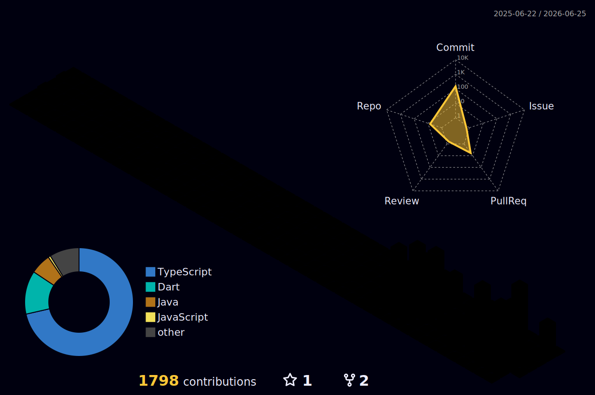

# Heey, tudo bem? 

Sou o **Rafael Aranda Martins**, apaixonado por **tecnologia**, **programação** e **jogos**.
- 💻 Trabalho como **Dev Front-end** (**Angular/TypeScript/PrimeNG**) na **DB System**.
- 🚀 Experiência sólida em **Angular**, **TypesCript/JavaScript**, **HTML** e **CSS/SCSS**;
- 🚀 Já trabalhei com **Flutter**, **Java**, **SQL**, ...
- 🎨 Gosto de explorar outras áreas como **Photoshop** e **Edição de Vídeos**.
- 📚 Sempre em busca de aprender e evoluir!

<br>

## 🌐 Me encontre

[](https://github.com/Skema1114)
[](https://gitlab.com/Skema1114)
[](https://www.linkedin.com/in/rafaelarandamartins/)
[](https://www.instagram.com/holdiny/)

<br>

## 📊 Minhas estatísticas

### 🚀 GitHub

<div>
  <a href="https://github.com/anuraghazra/github-readme-stats" target="_blank">
    
  </a>
  <br />
  <a href="https://github.com/denvercoder1/github-readme-streak-stats" target="_blank">
    
  </a>
  <br />
  <a href="https://github.com/vn7n24fzkq/github-profile-summary-cards" target="_blank"> 
    
  </a>
  <br />
  <a href="https://github.com/vn7n24fzkq/github-profile-summary-cards" target="_blank"> 
    
  </a>
  <br />
  <a href="https://github.com/Ashutosh00710/github-readme-activity-graph" target="_blank"> 
    
  </a>
</div>

### ⏳ WakaTime

<div>
  <a href="https://github.com/anuraghazra/github-readme-stats" target="_blank">
    
  </a>
  <br />
  <a href="https://github.com/anuraghazra/github-readme-stats" target="_blank">
    
  </a>
</div>

<br>

## 🏆 Conquistas

### 💻 Github

<div>
  <a href="https://github.com/ryo-ma/github-profile-trophy" target="_blank">
    
  </a>
</div>

<br>

### ✅ Todoist

<!-- TODO-IST:START -->

 Completei **0** tarefas hoje;<br>
 Completei **0** tarefas essa semana;<br>
 Completei **1028** tarefas no total;<br>
 Tenho **51** tarefas pendentes;

<!-- TODO-IST:END -->

<br>

## 🧊 3D

### 🧾 Commits



### 🐍 Snake

<a href="https://github.com/Platane/snk" target="_blank">
    <picture>
      <source media="(prefers-color-scheme: dark)" srcset="https://raw.githubusercontent.com/skema1114/skema1114/output/github-contribution-grid-snake-dark.svg">
      <source media="(prefers-color-scheme: light)" srcset="https://raw.githubusercontent.com/skema1114/skema1114/output/github-contribution-grid-snake.svg">
      
    </picture>
</a>

<br>

## 📈 Mais estatísticas

  

[](https://wakatime.com/@Skema1114)

<!--START_SECTION:waka-->


**Eu sou diurno 🐤** 

```text
🌞 Manhã                  19131 commits       ⣿⣿⣿⣿⣿⣿⣿⣿⣀⣀⣀⣀⣀⣀⣀⣀⣀⣀⣀⣀⣀⣀⣀⣀⣀   30.35 % 
🌆 Tarde                  32345 commits       ⣿⣿⣿⣿⣿⣿⣿⣿⣿⣿⣿⣿⣿⣀⣀⣀⣀⣀⣀⣀⣀⣀⣀⣀⣀   51.31 % 
🌃 Noite                  10522 commits       ⣿⣿⣿⣿⣀⣀⣀⣀⣀⣀⣀⣀⣀⣀⣀⣀⣀⣀⣀⣀⣀⣀⣀⣀⣀   16.69 % 
🌙 Madrugada              1041 commits        ⣀⣀⣀⣀⣀⣀⣀⣀⣀⣀⣀⣀⣀⣀⣀⣀⣀⣀⣀⣀⣀⣀⣀⣀⣀   01.65 % 
```
📅 **Sou mais produtivo em Terça-Feira** 

```text
Segunda-Feira            12602 commits       ⣿⣿⣿⣿⣿⣀⣀⣀⣀⣀⣀⣀⣀⣀⣀⣀⣀⣀⣀⣀⣀⣀⣀⣀⣀   19.99 % 
Terça-Feira              14099 commits       ⣿⣿⣿⣿⣿⣿⣀⣀⣀⣀⣀⣀⣀⣀⣀⣀⣀⣀⣀⣀⣀⣀⣀⣀⣀   22.37 % 
Quarta-Feira             12985 commits       ⣿⣿⣿⣿⣿⣀⣀⣀⣀⣀⣀⣀⣀⣀⣀⣀⣀⣀⣀⣀⣀⣀⣀⣀⣀   20.60 % 
Quinta-Feira             12000 commits       ⣿⣿⣿⣿⣿⣀⣀⣀⣀⣀⣀⣀⣀⣀⣀⣀⣀⣀⣀⣀⣀⣀⣀⣀⣀   19.04 % 
Sexta-Feira              10231 commits       ⣿⣿⣿⣿⣀⣀⣀⣀⣀⣀⣀⣀⣀⣀⣀⣀⣀⣀⣀⣀⣀⣀⣀⣀⣀   16.23 % 
Sábado                   552 commits         ⣀⣀⣀⣀⣀⣀⣀⣀⣀⣀⣀⣀⣀⣀⣀⣀⣀⣀⣀⣀⣀⣀⣀⣀⣀   00.88 % 
Domingo                  570 commits         ⣀⣀⣀⣀⣀⣀⣀⣀⣀⣀⣀⣀⣀⣀⣀⣀⣀⣀⣀⣀⣀⣀⣀⣀⣀   00.90 % 
```


📊 **Esta semana eu gastei meu tempo em** 

```text
🕑︎ Fuso horário: America/Sao_Paulo

💬 Linguagens de programação: 
Other                    1 hr 47 mins        ⣿⣿⣿⣿⣿⣿⣿⣿⣀⣀⣀⣀⣀⣀⣀⣀⣀⣀⣀⣀⣀⣀⣀⣀⣀   32.15 % 
Markdown                 59 mins             ⣿⣿⣿⣿⣀⣀⣀⣀⣀⣀⣀⣀⣀⣀⣀⣀⣀⣀⣀⣀⣀⣀⣀⣀⣀   17.91 % 
JSON                     54 mins             ⣿⣿⣿⣿⣀⣀⣀⣀⣀⣀⣀⣀⣀⣀⣀⣀⣀⣀⣀⣀⣀⣀⣀⣀⣀   16.26 % 
TypeScript               35 mins             ⣿⣿⣿⣀⣀⣀⣀⣀⣀⣀⣀⣀⣀⣀⣀⣀⣀⣀⣀⣀⣀⣀⣀⣀⣀   10.69 % 
XML                      31 mins             ⣿⣿⣀⣀⣀⣀⣀⣀⣀⣀⣀⣀⣀⣀⣀⣀⣀⣀⣀⣀⣀⣀⣀⣀⣀   09.31 % 

🔥 Editores: 
IntelliJ IDEA            5 hrs 33 mins       ⣿⣿⣿⣿⣿⣿⣿⣿⣿⣿⣿⣿⣿⣿⣿⣿⣿⣿⣿⣿⣿⣿⣿⣿⣿   100.00 % 

🐱‍💻 Projetos: 
propulsor-aduaneira-jee  3 hrs 12 mins       ⣿⣿⣿⣿⣿⣿⣿⣿⣿⣿⣿⣿⣿⣿⣀⣀⣀⣀⣀⣀⣀⣀⣀⣀⣀   57.68 % 
propulsor-ui             1 hr 23 mins        ⣿⣿⣿⣿⣿⣿⣀⣀⣀⣀⣀⣀⣀⣀⣀⣀⣀⣀⣀⣀⣀⣀⣀⣀⣀   25.12 % 
propulsor-api            31 mins             ⣿⣿⣀⣀⣀⣀⣀⣀⣀⣀⣀⣀⣀⣀⣀⣀⣀⣀⣀⣀⣀⣀⣀⣀⣀   09.33 % 
neural-purge             26 mins             ⣿⣿⣀⣀⣀⣀⣀⣀⣀⣀⣀⣀⣀⣀⣀⣀⣀⣀⣀⣀⣀⣀⣀⣀⣀   07.87 % 

💻 Sistema operacional: 
Linux                    5 hrs 33 mins       ⣿⣿⣿⣿⣿⣿⣿⣿⣿⣿⣿⣿⣿⣿⣿⣿⣿⣿⣿⣿⣿⣿⣿⣿⣿   100.00 % 
```

**Eu geralmente programo em TypeScript** 

```text
TypeScript               26 repos            ⣿⣿⣿⣿⣿⣿⣿⣿⣿⣀⣀⣀⣀⣀⣀⣀⣀⣀⣀⣀⣀⣀⣀⣀⣀   34.21 % 
JavaScript               12 repos            ⣿⣿⣿⣿⣀⣀⣀⣀⣀⣀⣀⣀⣀⣀⣀⣀⣀⣀⣀⣀⣀⣀⣀⣀⣀   15.79 % 
Dart                     7 repos             ⣿⣿⣀⣀⣀⣀⣀⣀⣀⣀⣀⣀⣀⣀⣀⣀⣀⣀⣀⣀⣀⣀⣀⣀⣀   09.21 % 
SCSS                     3 repos             ⣿⣀⣀⣀⣀⣀⣀⣀⣀⣀⣀⣀⣀⣀⣀⣀⣀⣀⣀⣀⣀⣀⣀⣀⣀   03.95 % 
C++                      2 repos             ⣿⣀⣀⣀⣀⣀⣀⣀⣀⣀⣀⣀⣀⣀⣀⣀⣀⣀⣀⣀⣀⣀⣀⣀⣀   02.63 % 
```


 Last Updated on 08/04/2026 13:19:55 UTC
<!--END_SECTION:waka-->

<br>

## 📝 Referências

<details>
  <summary>📚 <strong>Referências dos componentes</strong></summary>

### 🌐 Me encontre
- [skillicons](https://skillicons.dev)

### 🏆 Conquistas
- 💻 **GitHub**
  - [anuraghazra/github-readme-stats](https://github.com/anuraghazra/github-readme-stats)
  - [denvercoder1/github-readme-streak-stats](https://github.com/denvercoder1/github-readme-streak-stats)
  - [Ashutosh00710/github-readme-activity-graph](https://github.com/Ashutosh00710/github-readme-activity-graph)
  - [vn7n24fzkq/github-profile-summary-cards](https://github.com/vn7n24fzkq/github-profile-summary-cards)
- ✅ **Todoist**
  - [abhisheknaiidu/todoist-readme](https://github.com/abhisheknaiidu/todoist-readme)

### ⏳ WakaTime
- [anuraghazra/github-readme-stats](https://github.com/anuraghazra/github-readme-stats)
- [anmol098/waka-readme-stats](https://github.com/anmol098/waka-readme-stats)

### 🎧 Spotify (ouvi/ouvindo)
- [sndrjhlncgr/README-Spotify-Status](https://github.com/sndrjhlncgr/README-Spotify-Status)
- [novatorem/novatorem](https://github.com/novatorem/novatorem)

### 🧊 3D
- 🧾 **Commits**
  - [Post LinkedIn](https://www.linkedin.com/posts/isaac-gomes-matos_react-node-typescript-activity-7325493355243622400-wOaQ?utm_source=share&utm_medium=member_desktop&rcm=ACoAACZI1v8BpHNySvnqCFoliajjVXFMubrLn24)
  - [Action Isaac Gomes](https://github.com/isaac545454/isaac545454/blob/main/.github/workflows/profile-3d.yml)
- 🐍 **Snake**
  - [Platane/snk](https://github.com/Platane/snk)

### 📈 Outras estatísticas
- [antonkomarev/github-profile-views-counter](https://github.com/antonkomarev/github-profile-views-counter)
- [anmol098/waka-readme-stats](https://github.com/anmol098/waka-readme-stats)

### ⚙️ Perfis/Workflows de inspiração
- [Platane](https://github.com/Platane)
- [abhisheknaiidu](https://github.com/abhisheknaiidu)
- [anmol098](https://github.com/anmol098)
- [mishmanners](https://github.com/mishmanners)
- [isaac545454](https://github.com/isaac545454)

</details>
