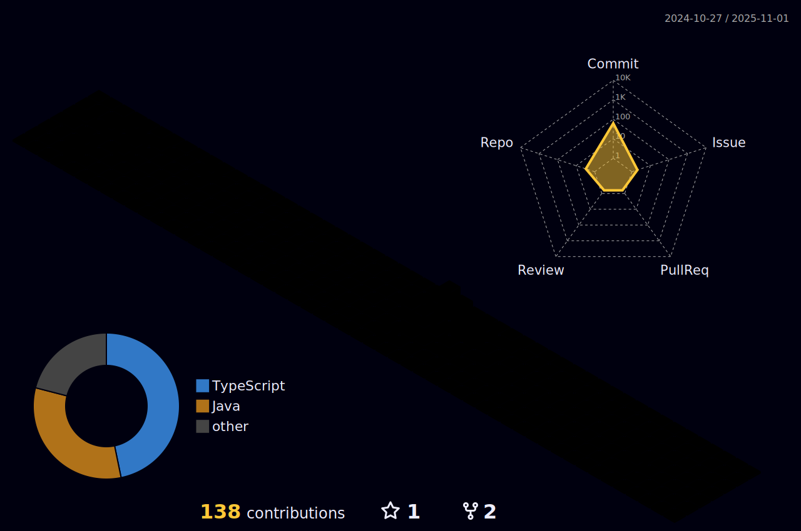

# Heey, tudo bem? 

Sou o **Rafael Aranda Martins**, apaixonado por **tecnologia**, **programação** e **jogos**.
- 💻 Trabalho como **Dev Front-end** (**Angular/TypeScript/PrimeNG**) na **DB System**.
- 🚀 Experiência sólida em **Angular**, **TypesCript/JavaScript**, **HTML** e **CSS/SCSS**;
- 🚀 Já trabalhei com **Flutter**, **Java**, **SQL**, ...
- 🎨 Gosto de explorar outras áreas como **Photoshop** e **Edição de Vídeos**.
- 📚 Sempre em busca de aprender e evoluir!

<br>

## 🌐 Me encontre

[](https://github.com/Skema1114)
[](https://gitlab.com/Skema1114)
[](https://www.linkedin.com/in/rafaelarandamartins/)
[](https://www.instagram.com/holdiny/)

<br>

## 📊 Minhas estatísticas

### 🚀 GitHub

<div>
  <a href="https://github.com/anuraghazra/github-readme-stats" target="_blank">
    
  </a>
  <br />
  <a href="https://github.com/denvercoder1/github-readme-streak-stats" target="_blank">
    
  </a>
  <br />
  <a href="https://github.com/vn7n24fzkq/github-profile-summary-cards" target="_blank"> 
    
  </a>
  <br />
  <a href="https://github.com/vn7n24fzkq/github-profile-summary-cards" target="_blank"> 
    
  </a>
  <br />
  <a href="https://github.com/Ashutosh00710/github-readme-activity-graph" target="_blank"> 
    
  </a>
</div>

### ⏳ WakaTime

<div>
  <a href="https://github.com/anuraghazra/github-readme-stats" target="_blank">
    
  </a>
  <br />
  <a href="https://github.com/anuraghazra/github-readme-stats" target="_blank">
    
  </a>
</div>

<br>

## 🏆 Conquistas

### 💻 Github

<div>
  <a href="https://github.com/ryo-ma/github-profile-trophy" target="_blank">
    
  </a>
</div>

<br>

### ✅ Todoist

<!-- TODO-IST:START -->
 Possuo **11,651** pontos de Karma;           
 Completei **0** tarefas hoje;           
 Completei **1,026** tarefas no total;           
 Sequência mais longa é de **8** dias;
<!-- TODO-IST:END -->

<br>

## 🧊 3D

### 🧾 Commits



### 🐍 Snake

<a href="https://github.com/Platane/snk" target="_blank">
    <picture>
      <source media="(prefers-color-scheme: dark)" srcset="https://raw.githubusercontent.com/skema1114/skema1114/output/github-contribution-grid-snake-dark.svg">
      <source media="(prefers-color-scheme: light)" srcset="https://raw.githubusercontent.com/skema1114/skema1114/output/github-contribution-grid-snake.svg">
      
    </picture>
</a>

<br>

## 📈 Mais estatísticas

  

[](https://wakatime.com/@Skema1114)

<!--START_SECTION:waka-->


**Eu sou diurno 🐤** 

```text
🌞 Manhã                  24004 commits       ⣿⣿⣿⣿⣿⣿⣿⣿⣀⣀⣀⣀⣀⣀⣀⣀⣀⣀⣀⣀⣀⣀⣀⣀⣀   30.71 % 
🌆 Tarde                  40654 commits       ⣿⣿⣿⣿⣿⣿⣿⣿⣿⣿⣿⣿⣿⣀⣀⣀⣀⣀⣀⣀⣀⣀⣀⣀⣀   52.01 % 
🌃 Noite                  12556 commits       ⣿⣿⣿⣿⣀⣀⣀⣀⣀⣀⣀⣀⣀⣀⣀⣀⣀⣀⣀⣀⣀⣀⣀⣀⣀   16.06 % 
🌙 Madrugada              954 commits         ⣀⣀⣀⣀⣀⣀⣀⣀⣀⣀⣀⣀⣀⣀⣀⣀⣀⣀⣀⣀⣀⣀⣀⣀⣀   01.22 % 
```
📅 **Sou mais produtivo em Terça-Feira** 

```text
Segunda-Feira            15574 commits       ⣿⣿⣿⣿⣿⣀⣀⣀⣀⣀⣀⣀⣀⣀⣀⣀⣀⣀⣀⣀⣀⣀⣀⣀⣀   19.92 % 
Terça-Feira              17388 commits       ⣿⣿⣿⣿⣿⣿⣀⣀⣀⣀⣀⣀⣀⣀⣀⣀⣀⣀⣀⣀⣀⣀⣀⣀⣀   22.24 % 
Quarta-Feira             16282 commits       ⣿⣿⣿⣿⣿⣀⣀⣀⣀⣀⣀⣀⣀⣀⣀⣀⣀⣀⣀⣀⣀⣀⣀⣀⣀   20.83 % 
Quinta-Feira             14782 commits       ⣿⣿⣿⣿⣿⣀⣀⣀⣀⣀⣀⣀⣀⣀⣀⣀⣀⣀⣀⣀⣀⣀⣀⣀⣀   18.91 % 
Sexta-Feira              12868 commits       ⣿⣿⣿⣿⣀⣀⣀⣀⣀⣀⣀⣀⣀⣀⣀⣀⣀⣀⣀⣀⣀⣀⣀⣀⣀   16.46 % 
Sábado                   613 commits         ⣀⣀⣀⣀⣀⣀⣀⣀⣀⣀⣀⣀⣀⣀⣀⣀⣀⣀⣀⣀⣀⣀⣀⣀⣀   00.78 % 
Domingo                  661 commits         ⣀⣀⣀⣀⣀⣀⣀⣀⣀⣀⣀⣀⣀⣀⣀⣀⣀⣀⣀⣀⣀⣀⣀⣀⣀   00.85 % 
```


📊 **Esta semana eu gastei meu tempo em** 

```text
🕑︎ Fuso horário: America/Sao_Paulo

💬 Linguagens de programação: 
TypeScript               10 hrs 54 mins      ⣿⣿⣿⣿⣿⣿⣿⣿⣿⣿⣿⣿⣀⣀⣀⣀⣀⣀⣀⣀⣀⣀⣀⣀⣀   49.68 % 
HTML                     9 hrs 27 mins       ⣿⣿⣿⣿⣿⣿⣿⣿⣿⣿⣿⣀⣀⣀⣀⣀⣀⣀⣀⣀⣀⣀⣀⣀⣀   43.08 % 
SCSS                     1 hr 33 mins        ⣿⣿⣀⣀⣀⣀⣀⣀⣀⣀⣀⣀⣀⣀⣀⣀⣀⣀⣀⣀⣀⣀⣀⣀⣀   07.09 % 
JSON                     2 mins              ⣀⣀⣀⣀⣀⣀⣀⣀⣀⣀⣀⣀⣀⣀⣀⣀⣀⣀⣀⣀⣀⣀⣀⣀⣀   00.15 % 

🔥 Editores: 
VS Code                  19 hrs 43 mins      ⣿⣿⣿⣿⣿⣿⣿⣿⣿⣿⣿⣿⣿⣿⣿⣿⣿⣿⣿⣿⣿⣿⣀⣀⣀   89.79 % 
Antigravity              2 hrs 14 mins       ⣿⣿⣿⣀⣀⣀⣀⣀⣀⣀⣀⣀⣀⣀⣀⣀⣀⣀⣀⣀⣀⣀⣀⣀⣀   10.21 % 

🐱‍💻 Projetos: 
propulsor-ui             21 hrs 57 mins      ⣿⣿⣿⣿⣿⣿⣿⣿⣿⣿⣿⣿⣿⣿⣿⣿⣿⣿⣿⣿⣿⣿⣿⣿⣿   100.00 % 

💻 Sistema operacional: 
Windows                  21 hrs 57 mins      ⣿⣿⣿⣿⣿⣿⣿⣿⣿⣿⣿⣿⣿⣿⣿⣿⣿⣿⣿⣿⣿⣿⣿⣿⣿   100.00 % 
```

**Eu geralmente programo em TypeScript** 

```text
TypeScript               25 repos            ⣿⣿⣿⣿⣿⣿⣿⣿⣿⣀⣀⣀⣀⣀⣀⣀⣀⣀⣀⣀⣀⣀⣀⣀⣀   37.88 % 
Java                     13 repos            ⣿⣿⣿⣿⣿⣀⣀⣀⣀⣀⣀⣀⣀⣀⣀⣀⣀⣀⣀⣀⣀⣀⣀⣀⣀   19.70 % 
JavaScript               10 repos            ⣿⣿⣿⣿⣀⣀⣀⣀⣀⣀⣀⣀⣀⣀⣀⣀⣀⣀⣀⣀⣀⣀⣀⣀⣀   15.15 % 
Dart                     7 repos             ⣿⣿⣿⣀⣀⣀⣀⣀⣀⣀⣀⣀⣀⣀⣀⣀⣀⣀⣀⣀⣀⣀⣀⣀⣀   10.61 % 
C++                      2 repos             ⣿⣀⣀⣀⣀⣀⣀⣀⣀⣀⣀⣀⣀⣀⣀⣀⣀⣀⣀⣀⣀⣀⣀⣀⣀   03.03 % 
```


 Last Updated on 27/12/2025 01:03:01 UTC
<!--END_SECTION:waka-->

<br>

## 📝 Referências

<details>
  <summary>📚 <strong>Referências dos componentes</strong></summary>

### 🌐 Me encontre
- [skillicons](https://skillicons.dev)

### 🏆 Conquistas
- 💻 **GitHub**
  - [anuraghazra/github-readme-stats](https://github.com/anuraghazra/github-readme-stats)
  - [denvercoder1/github-readme-streak-stats](https://github.com/denvercoder1/github-readme-streak-stats)
  - [Ashutosh00710/github-readme-activity-graph](https://github.com/Ashutosh00710/github-readme-activity-graph)
  - [vn7n24fzkq/github-profile-summary-cards](https://github.com/vn7n24fzkq/github-profile-summary-cards)
- ✅ **Todoist**
  - [abhisheknaiidu/todoist-readme](https://github.com/abhisheknaiidu/todoist-readme)

### ⏳ WakaTime
- [anuraghazra/github-readme-stats](https://github.com/anuraghazra/github-readme-stats)
- [anmol098/waka-readme-stats](https://github.com/anmol098/waka-readme-stats)

### 🎧 Spotify (ouvi/ouvindo)
- [sndrjhlncgr/README-Spotify-Status](https://github.com/sndrjhlncgr/README-Spotify-Status)
- [novatorem/novatorem](https://github.com/novatorem/novatorem)

### 🧊 3D
- 🧾 **Commits**
  - [Post LinkedIn](https://www.linkedin.com/posts/isaac-gomes-matos_react-node-typescript-activity-7325493355243622400-wOaQ?utm_source=share&utm_medium=member_desktop&rcm=ACoAACZI1v8BpHNySvnqCFoliajjVXFMubrLn24)
  - [Action Isaac Gomes](https://github.com/isaac545454/isaac545454/blob/main/.github/workflows/profile-3d.yml)
- 🐍 **Snake**
  - [Platane/snk](https://github.com/Platane/snk)

### 📈 Outras estatísticas
- [antonkomarev/github-profile-views-counter](https://github.com/antonkomarev/github-profile-views-counter)
- [anmol098/waka-readme-stats](https://github.com/anmol098/waka-readme-stats)

### ⚙️ Perfis/Workflows de inspiração
- [Platane](https://github.com/Platane)
- [abhisheknaiidu](https://github.com/abhisheknaiidu)
- [anmol098](https://github.com/anmol098)
- [mishmanners](https://github.com/mishmanners)
- [isaac545454](https://github.com/isaac545454)

</details>
